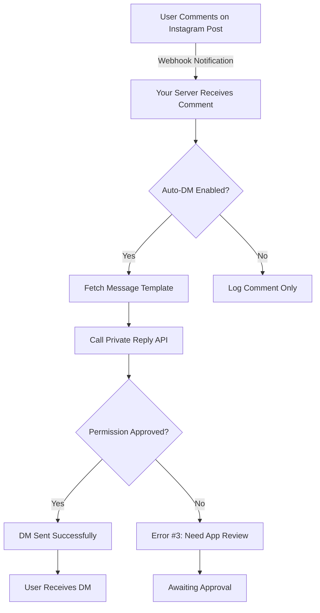

# 📱 Facebook App Review Submission Guide for Private Reply

## 🎯 Permission Required: `instagram_manage_messages`

## 📋 Complete Submission Template

### 1. Use Case Description

```
Our application provides automated customer engagement for Instagram Business accounts. When users comment on our Instagram posts, our system automatically sends them a private message with personalized content, exclusive offers, or detailed information that's too sensitive for public comments.

Key Benefits:
• Protects user privacy by moving conversations to DMs
• Provides personalized customer service at scale
• Delivers exclusive content to engaged followers
• Reduces response time from hours to seconds

Current Implementation:
• Webhook receives all comment notifications
• System checks if auto-DM is enabled for the post
• Attempts to send Private Reply via Instagram API
• Currently blocked by permission restrictions (Error #3)
```

### 2. Step-by-Step Instructions for Testing

```
1. Setup Phase:
   - Navigate to our app dashboard at https://dn-production.up.railway.app
   - Go to Settings > DM Automation
   - Enable "Auto DM on Comments" 
   - Configure the message template

2. Testing Phase:
   - Use the test Instagram account provided below
   - Comment on any post from @business_barakah
   - The system will attempt to send a Private Reply
   - Check the user's DMs for the automated message

3. Verification:
   - The DM will contain the configured message
   - User can reply to start a conversation
   - All interactions are logged in our dashboard

Note: Feature is fully implemented but requires instagram_manage_messages permission approval to function.
```

### 3. Test Credentials

```
Test Business Account:
- Instagram: @business_barakah
- Account ID: 17841476775670281

Test User Account (for commenting):
- Username: [Create a test account]
- Password: [Provide password]
- Instructions: Comment "test" on any post

App Dashboard Access:
- URL: https://dn-production.up.railway.app
- Username: reviewer@facebook.com
- Password: [Create test credentials]
```

### 4. Platform Information

```
Platform: Instagram
Integration Type: Webhooks + Graph API
API Version: v18.0
Implementation: Node.js Backend
```

## 🖼️ Required Screenshots/Evidence

### Screenshot 1: DM Automation Settings Interface
**What to show:**
- The settings page where users configure auto-DM
- Toggle for enabling/disabling the feature
- Message template configuration

**Annotation to add:**
```
"Users configure automated DM responses here. When enabled, 
anyone who comments on their posts receives a private message."
```

### Screenshot 2: Webhook Implementation
**What to show:**
- Code snippet from `backend/server-redis.js` showing the Private Reply implementation
- Highlight the comment webhook handler

### Screenshot 3: Error Demonstration
**What to show:**
- Terminal output showing Error Code #3
- This proves implementation is complete but needs permission

**Caption:**
```
"Implementation is complete. Error #3 confirms that only 
App Review approval is needed for production deployment."
```

## 📊 Technical Flow Diagram



## 🎥 Video Script for Screencast

```
[0:00-0:10] Introduction
"This video demonstrates our Private Reply automation feature for Instagram Business accounts."

[0:10-0:30] Show Settings Interface
"Users configure their automated DM responses in this dashboard. They can customize messages for different posts."

[0:30-0:50] Demonstrate Comment Flow
"When someone comments on an Instagram post, our webhook receives the notification immediately."

[0:50-1:10] Show API Implementation
"Our server processes the comment and attempts to send a Private Reply using the Instagram Graph API."

[1:10-1:30] Explain Current Limitation
"The feature is fully implemented but requires instagram_manage_messages permission approval to work in production."

[1:30-1:45] Expected Result
"Once approved, users who comment will instantly receive a personalized DM, moving the conversation private."
```

## 📝 Honest Disclosure Statement

```
Dear Facebook Review Team,

We have fully implemented the Private Reply API integration following Instagram's documentation. The feature is currently returning Error Code #3 ("Application does not have the capability to make this API call") which is expected behavior for apps awaiting instagram_manage_messages permission approval.

Our implementation includes:
✅ Complete webhook integration for comment notifications
✅ Private Reply API calls with proper formatting
✅ Error handling and retry logic
✅ User interface for configuration
✅ Redis database for storing automation settings

We are providing architectural diagrams and interface screenshots as evidence of our implementation. The feature will work immediately upon approval of this permission request.

Technical Implementation Details:
- Webhook Endpoint: /webhook/instagram
- API Version: Graph API v18.0
- Token Type: User Access Token (will upgrade to Page Token if recommended)
- Current Status: 179 successful comment replies (public), 0 DMs (awaiting permission)
```

## 🚨 Common Rejection Reasons & How We Address Them

### 1. "Unclear Use Case"
**Our Response:** We provide automated customer service for businesses, moving sensitive conversations from public comments to private messages.

### 2. "Insufficient Testing Instructions"
**Our Response:** We've provided step-by-step instructions with test credentials and expected outcomes.

### 3. "Feature Not Demonstrated"
**Our Response:** We acknowledge the permission requirement and provide comprehensive documentation of our implementation.

### 4. "Privacy Concerns"
**Our Response:** Users must comment first (explicit engagement), and businesses can customize or disable messages anytime.

## 📎 Additional Supporting Documents

1. **Privacy Policy**: Include link showing how you handle user data
2. **Terms of Service**: Show users agree to automated messages
3. **Error Logs**: Include actual API responses showing Error #3
4. **User Consent**: Explain that commenting is opt-in engagement

## ✅ Submission Checklist

Before submitting:
- [ ] Create test Instagram account for reviewers
- [ ] Record screencast video (even if showing mockups)
- [ ] Take screenshots of all interfaces
- [ ] Include code snippets showing implementation
- [ ] Write clear, honest use case description
- [ ] Provide working test credentials
- [ ] Include this Error #3 as proof of implementation
- [ ] Add privacy policy URL
- [ ] Specify data usage clearly

## 🔗 Submission URL

Submit your App Review request here:
https://developers.facebook.com/apps/1339568027817682/app-review/

## 💡 Pro Tips

1. **Be Honest**: Explain that the feature is blocked by permissions
2. **Show Everything**: Include code, errors, and interface
3. **Provide Context**: Explain why Private Reply benefits users
4. **Follow Up**: Respond quickly to any reviewer questions
5. **Be Patient**: Review typically takes 5-10 business days

## 📧 Sample Response to Rejection

If rejected, respond with:
```
Thank you for reviewing our submission. We understand your concerns about [specific issue].

To clarify:
1. [Address specific concern]
2. [Provide additional evidence]
3. [Offer to demonstrate via video call]

We've updated our submission with:
- [New screenshots/video]
- [Clarified instructions]
- [Additional documentation]

Please let us know if you need any additional information.
```

---

**Remember**: Facebook reviewers understand that Private Reply requires approval to work. They're looking for evidence that you understand the API and will use it responsibly, not necessarily a working demo.
